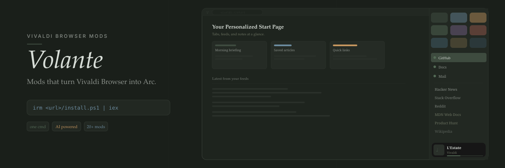

<p align="center">
  
</p>

<div align="center">

[](https://deepwiki.com/PaRr0tBoY/Awesome-Vivaldi)
[](https://forum.vivaldi.net/topic/112064/modpack-community-essentials-mods-collection?_=1761221602450)
[](https://linux.do)
[](https://awesome.re)


**English** | [简体中文](./Doc/READMEZH/READMEMAIN.md)

</div>

---

## Quick Start

Works with [Vivaldi 8.0+](./Vivaldi8.0Stable). Check your version at `vivaldi:about`.

**Windows** (PowerShell):

```powershell
irm https://raw.githubusercontent.com/PaRr0tBoY/Awesome-Vivaldi/main/install.ps1 | iex
```

**macOS** (bash):

```bash
curl -fsSL https://raw.githubusercontent.com/PaRr0tBoY/Awesome-Vivaldi/main/install.sh | bash
```

**Linux** (bash):

```bash
curl -fsSL https://raw.githubusercontent.com/PaRr0tBoY/Awesome-Vivaldi/main/install.sh | sudo bash
```

To uninstall, run the same script again.

> Prefer manual setup? See the **[Installation Guide](./Vivaldi8.0Stable/README.md)**.
> Have a coding agent? Ask it: `Install https://github.com/PaRr0tBoY/Awesome-Vivaldi for me.`

<p align="center">
  
</p>

---

<p align="center">
  
</p>

| Feature                                         | Mod Files                            | What it does                                                                                 |
|:----------------------------------------------- |:------------------------------------ |:-------------------------------------------------------------------------------------------- |
|        | `VividPeek.css` + `VividPeek.js`     | Arc-style peek dialog — preview tabs in a floating overlay without leaving your current page |
|  | `VividPlayer.css` + `VividPlayer.js` | Media player popover with progress bar, artwork, and playback controls                       |
|    | `PeekTabbar.css`                     | Auto-hide tabbar that expands on hover, with two-level stacking                              |

---

<p align="center">
  
</p>

Requires an [OpenAI-compatible API key](https://github.com/cheahjs/free-llm-api-resources?tab=readme-ov-file#opencode-zen). Configure in `vivaldi:settings/appearance/` → Volante settings.

| Feature                                             | Mod Files                        | What it does                                                       |
|:--------------------------------------------------- |:-------------------------------- |:------------------------------------------------------------------ |
|          | `TidyTabs.js` + `TidyTitles.js`  | AI-powered tab grouping and title cleanup                          |
|  | `TidyDownloads.js`               | Rename messy download filenames into readable names                |
|      | `TidyAddress.js`                 | Rewrite URL suffixes into human-readable slugs                     |
|          | `AskOnPage.js` + `AskOnPage.css` | Ctrl+F AI page search — find or ask anything with inline citations |

---

## Mod List

### CSS Mods

| File                      | Description                                             |
|:------------------------- |:------------------------------------------------------- |
| `VividToast.css`          | Toast notification theming                              |
| `VividPeek.css`           | Arc peek overlay styling*(requires `VividPeek.js`)*     |
| `PeekTabbar.css`          | Auto-hide tabbar with two-level stacking on hover       |
| `VividPlayer.css`         | Media player popover styling                            |
| `VividQC.css`             | Arc-like quick command styling                          |
| `TidyTabs.css`            | AI tab grouping visual output*(requires `TidyTabs.js`)* |
| `AskOnPage.css`           | Floating AI find bar styling                            |
| `Quietify.css`            | Sleeker audio indicator                                 |
| `TabsTrail.css`           | Green trail on active/hovered tabs                      |
| `AdaptiveBF.css`          | Hide back/forward buttons when unnecessary              |
| `BetterAnimation.css`     | Smoother overscroll animation                           |
| `RemoveClutter.css`       | Hide scrollbars and visual clutter                      |
| `PinnedTabRestore.css`    | Restore pinned tab state on restart                     |
| `InteractionFeedback.css` | Hover and click micro-interactions                      |
| `DownloadPanel.css`       | Download panel theming                                  |
| `Extensions.css`          | Extensions dropdown as list                             |
| `FavouriteTabs.css`       | Arc-like favourite tabs grid*(first 9 pinned tabs)*     |
| `BtnHoverAnime.css`       | Button hover animation*(disabled by default)*           |

### JavaScript Mods

| File                 | Description                                                                |
|:-------------------- |:-------------------------------------------------------------------------- |
| `VividPeek.js`       | [Arc peek dialog](./Doc/mod/VividPeek.md) — preview tabs without switching |
| `AskOnPage.js`       | Ctrl+F AI page search with inline citations                                |
| `Diabar.js`          | [AI sidebar chat](./Doc/mod/Diabar.md) — page Q&A, summaries, rewrites     |
| `TidyTabs.js`        | [AI tab grouping](./Doc/mod/TidyTabs.md)                                   |
| `TidyTitles.js`      | [AI tab title cleanup](./Doc/mod/TidyTitles.md)                            |
| `TidyDownloads.js`   | [AI download filename cleanup](./Doc/mod/TidyDownloads.md)                 |
| `TidyAddress.js`     | [URL suffix → readable slug](./Doc/mod/TidyAddress.md)                     |
| `ModConfig.js`       | [Shared settings panel](./Doc/mod/ModConfig.md) for AI keys and mod config |
| `VividToast.js`      | [Toast notification logic](./Doc/mod/VividToast.md)                        |
| `QuickCapture.js`    | [Auto-select capture area](./Doc/mod/QuickCapture.md)                      |
| `MonochromeIcons.js` | [Monochrome web panel icons](./Doc/mod/MonochromeIcons.md)                 |
| `EasyFiles.js`       | [Opera-inspired file attachment](./Doc/mod/EasyFiles.md)                   |
| `TabManager.js`      | [Workspace board panel](./Doc/mod/TabManager.md)                           |
| `AutoHidePanel.js`   | [Auto-hide side panel](./Doc/mod/AutoHidePanel.md)                         |

---

## Documentation

Browse the full docs at **[parr0tboy.github.io/docs](https://parr0tboy.github.io/docs/)** — design philosophy, mod architecture deep-dives, API references, and reverse-engineered Vivaldi internals.

---

<details>
<summary><h2>Community Mods</h2></summary>

These mods come from the [Vivaldi Forum](https://forum.vivaldi.net/) and are included in the pack:

| Mod                          | Source                                                                                                                                       |
|:---------------------------- |:-------------------------------------------------------------------------------------------------------------------------------------------- |
| Element Capture              | [Forum](https://forum.vivaldi.net/topic/103686/element-capture) — auto-select capture area for screenshots                                   |
| Colorful Tabs                | [Forum](https://forum.vivaldi.net/topic/96586/colorful-tabs) — icon-derived tab coloring                                                     |
| Monochrome Icons             | [Forum](https://forum.vivaldi.net/topic/102661/monochrome-icons) — tone down web panel icons                                                 |
| Easy Files                   | [Forum](https://forum.vivaldi.net/topic/94531/easy-files) — clipboard + downloads file picker                                                |
| Command Chains Import/Export | [Forum](https://forum.vivaldi.net/topic/93964/import-export-command-chains) — import/export command chains                                   |
| Click to Add Blocking List   | [Forum](https://forum.vivaldi.net/topic/45735/click-to-add-blocking-list) — one-click adblock list install                                   |
| Global Media Controls        | [Forum](https://forum.vivaldi.net/topic/66803/global-media-controls-panel) — Chrome-style media panel                                        |
| Markdown Editor for Notes    | [Forum](https://forum.vivaldi.net/topic/35644/markdown-editor-for-notes) — markdown editing in notes                                         |
| Open Panels on Mouse-Over    | [Forum](https://forum.vivaldi.net/topic/28413/open-panels-on-mouse-over) — auto-open/close panels on hover                                   |
| Dashboard Camo               | [Forum](https://forum.vivaldi.net/topic/102173/dashboard-camo-theme-integration-for-dashboard-webpages) — theme-aware widget styling         |
| Colorful Top Loading Bar     | [Forum](https://forum.vivaldi.net/topic/111621/colorful-top-loading-bar) — animated title bar on page load                                   |
| Feed Icons                   | [Forum](https://forum.vivaldi.net/topic/73001/feed-icons) — convert feed icons to favicons                                                   |
| Address Bar (Yandex-style)   | [Forum](https://forum.vivaldi.net/topic/96072/address-bar-like-in-yandex-browser) — title + domain display                                   |
| Open in Dialog               | [Forum](https://forum.vivaldi.net/topic/92501/open-in-dialog-mod) — open links in popup dialogs                                              |
| Tab Stack Auto-Expand        | [Forum](https://forum.vivaldi.net/topic/111893/auto-expand-and-collapse-tabbar-for-two-level-tab-stack-rework) — auto expand/collapse tabbar |
| Theme Previews Plus          | [Forum](https://forum.vivaldi.net/topic/103422/theme-previews-plus) — accurate theme preview in settings                                     |
| VivalArc                     | [GitHub](https://github.com/tovifun/VivalArc) — Arc theme port                                                                               |

</details>

---

## Tip

<details>
<summary>Create a one-click restart button (useful for mod development)</summary>

1. Go to `vivaldi://vivaldi-urls/` → enable **internal debugging pages**
2. Create a Quick Command at `vivaldi:settings/qc/`: **Open Link in Current Tab** → `chrome://restart`
3. Add it to the toolbar via **customize toolbar**
4. Optionally change the icon at `vivaldi:settings/themes/`

</details>

---

Special thanks to the [LINUX DO](https://linux.do) community for the support.

