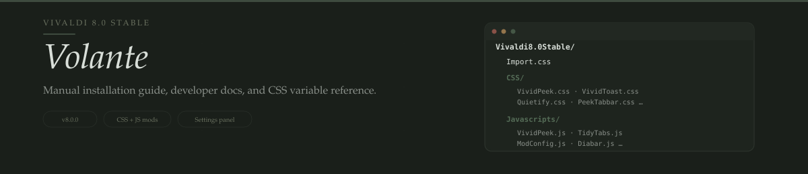

<p align="center">
  
</p>

<div align="center">

[](https://deepwiki.com/PaRr0tBoY/Awesome-Vivaldi)
[](https://forum.vivaldi.net/topic/112064/modpack-community-essentials-mods-collection?_=1761221602450)


**English** | [简体中文](../Doc/READMEZH/README80.md)

</div>

---

## Table of Contents

- [Prerequisites](#prerequisites)
- [Install CSS Mods](#install-css-mods)
- [Install JavaScript Mods](#install-javascript-mods)
- [Settings Panel](#settings-panel)
- [Update](#update)
- [Development](#development)
- [FAQ](#faq)

---

## Prerequisites

Open `vivaldi:about` to check your version. Then apply these settings:

| Setting | Path | Value |
|:---|:---|:---|
| UI Auto-hide | `vivaldi:settings/appearance/` → UI Auto-Hide | **Enable** |
| Tab Stacking | `vivaldi:settings/tabs/` → Tab Stacking | **Two-Level** (not compact) |
| New Tab Position | `vivaldi:settings/tabs/` → New Tab Position | **As Tab Stack with Related Tab** |
| Quick Commands | `vivaldi:settings/qc/` → Quick Command Options | **Open Links in New Tab** |

---

## Install CSS Mods

1. Open `vivaldi://flags/#vivaldi-css-mods` → **Enable** → restart
2. Go to **Settings → Appearance → Custom UI Modifications**
3. Select the folder containing `Import.css` (this folder: `Vivaldi8.0Stable/`)
4. Restart Vivaldi

> **7.7+**: CSS mods flag moved under `vivaldi://flags/` — search for "vivaldi-" or go to `chrome://flags/#vivaldi-css-mods`.
>
> **File naming**: No spaces in CSS filenames. Directory paths are fine. Verify extensions are visible on Windows.

---

## Install JavaScript Mods

### Automatic

| Platform | Tool |
|:---|:---|
| Windows | [Vivaldi Mod Manager](https://github.com/eximido/vivaldimodmanager) |
| Linux | [vivaldi-autoinject-custom-js-ui (AUR)](https://aur.archlinux.org/vivaldi-autoinject-custom-js-ui.git) |
| All | [Patching Vivaldi with batch scripts](https://forum.vivaldi.net/topic/10592/patching-vivaldi-with-batch-scripts/21?page=2) |
| macOS | [upviv patch script](https://github.com/PaRr0tBoY/Vivaldi-Mods/blob/8a1e9f8a63f195f67f27ab2e5b86c4aff0081096/MacOSPatchScripts/upviv) |

### Manual

> ⚠️ Back up `window.html` before editing. A broken file can prevent Vivaldi from starting.

1. Copy all files from [`Javascripts/`](./Javascripts/) to:
   ```
   <VIVALDI>/Application/<VERSION>/resources/vivaldi/
   ```
2. The included `window.html` already references all mods — replace the original
3. Restart Vivaldi
4. Verify at `vivaldi:inspect/#apps` → inspect `window.html` → check the Elements tab for `<script>` tags

<details>
<summary>What window.html looks like</summary>

```html
<!-- Vivaldi window document -->
<!DOCTYPE html>
<html>
  <head>
    <meta charset="UTF-8" />
    <title>Vivaldi</title>
    <link rel="stylesheet" href="style/common.css" />
    <link rel="stylesheet" href="chrome://vivaldi-data/css-mods/css" />
  </head>

  <body>
    <script src="TidyTitles.js"></script>
    <script src="TidyTabs.js"></script>
    <script src="TidyDownloads.js"></script>
    <script src="Diabar.js"></script>
    <script src="AskOnPage.js"></script>
    <script src="TabScroll.js"></script>
    <script src="MonochromeIcons.js"></script>
    <script src="VividAddress.js"></script>
    <script src="QuickCapture.js"></script>
    <script src="GlobalMediaControls.js"></script>
    <script src="EasyFiles.js"></script>
    <script src="ModConfig.js"></script>
    <script src="VividPeek.js"></script>
  </body>
</html>
```

</details>

> **AI features**: Get a free OpenAI-compatible API key at [cheahjs/free-llm-api-resources](https://github.com/cheahjs/free-llm-api-resources?tab=readme-ov-file#opencode-zen).

---

## Settings Panel

`ModConfig.js` adds a **Volante** section to `vivaldi:settings/appearance/`:

1. Install `ModConfig.js` with the other JS mods → restart
2. Open `vivaldi:settings/appearance/` → find **Volante**
3. Configure:
   - **AI Config** — endpoint, API key, model, per-mod overrides
   - **Arc Peek** — click modifiers, long-press buttons, hold timing, auto-open patterns
   - **Quick Capture** / **Auto Hide Panel** — behavior toggles
4. **Save** after changes. Use **Import** / **Export** to sync across profiles

Settings are stored in `.askonpage/config.json` (Origin Private File System). Supported mods reload saved values automatically.

---

## Update

```bash
cd path/to/Awesome-Vivaldi
git pull

# Re-copy CSS mods folder contents to Vivaldi CSS mods folder
# Re-copy Javascripts/ to <VIVALDI>/Application/<VERSION>/resources/vivaldi/
# Update window.html if new script references were added
```

---

## Development

### Architecture

- **CSS** — referenced via `@import` in `Import.css`. Add new `.css` files to `CSS/` and import in `Import.css`
- **JavaScript** — referenced via `<script>` in `window.html`. Add new `.js` files to `Javascripts/` and add a `<script>` tag

### File Metadata

<details>
<summary>CSS — UserStyle format</summary>

```css
/* ==UserStyle==
 * @name         Your Mod Name
 * @description  Brief description
 * @version      YYYY.MM.DD
 * @author       Your Name
 * @website      https://github.com/PaRr0tBoY/Awesome-Vivaldi
 * ==/UserStyle==
 */
```

</details>

<details>
<summary>JavaScript — UserScript format</summary>

```javascript
// ==UserScript==
// @name         YourMod
// @description  Brief description
// @version      YYYY.MM.DD
// @author       Your Name
// ==/UserScript==
```

</details>

### Inspecting Vivaldi UI

Use `vivaldi:inspect/#apps` → click **inspect** on `window.html` to open DevTools for the browser chrome. See the [Vivaldi UI Inspect Tutorial](https://forum.vivaldi.net/post/135732).

### CSS Gotchas

| Issue | Solution |
|:---|:---|
| Variables break between versions | Verify with Computed Styles; prefer hardcoded `px` |
| CSS Anchor Positioning unreliable | Use `left: 50%; transform: translateX(-50%)` instead |
| Need to style earlier DOM element | Use `:has()` on a common parent |
| Vivaldi sets inline styles via JS | Use `position: fixed !important` or `!important` |

### JavaScript Gotchas

| Issue | Solution |
|:---|:---|
| MV3 script execution | Use `chrome.scripting.executeScript`, not `chrome.tabs.executeScript` |
| Workspace rebuilds `.tab-strip` | Attach MutationObserver to `#browser`, rebind inner observers on rebuild |
| `chrome://` / `vivaldi://` tabs | Always check `tab.url` before `executeScript` — it throws on internal pages |

### Resources

- [PrettyBundle.js](../Others/UsefulResources/Source/source/pretty-bundle.js) & [common.css](../Others/UsefulResources/Source/source/common.css) — Vivaldi's core bundle files
- [Docs portal](https://parr0tboy.github.io/docs/) — JavaScript mods API reference
- [Vivaldi Browser Source](https://github.com/ric2b/Vivaldi-browser) | [DeepWiki](https://deepwiki.com/ric2b/Vivaldi-browser)
- [Lonm's API Reference](https://lonmcgregor.github.io/VivaldiModdersAPI/OfficialApi/everything.html)

### Vivaldi CSS Variables

Theme-aware custom properties on `#browser` — values change with theme, reference by `var()` name only.

<details>
<summary>Full variable reference</summary>

| Category | Key variables |
|:---|:---|
| **Background** | `--colorBg`, `--colorBgAlpha`, `--colorBgDark`/`Darker`, `--colorBgLight`/`Lighter`, `--colorBgIntense`/`Intenser`, `--colorBgInverse`, `--colorBgFaded` |
| **Foreground** | `--colorFg`, `--colorFgIntense`, `--colorFgFaded`/`FadedMore`/`FadedMost` |
| **Highlight** | `--colorHighlightBg`, `--colorHighlightFg`, `--colorHighlightBgDark`, `--colorHighlightBgAlpha` |
| **Accent** | `--colorAccentBg`, `--colorAccentFg`, `--colorAccentBorder`, `--colorAccentBgDark`/`Darker` |
| **Border** | `--colorBorder`, `--colorBorderSubtle`, `--colorBorderIntense`, `--colorBorderDisabled` |
| **Semantic** | `--colorSuccessBg`/`Fg`, `--colorWarningBg`/`Fg`, `--colorErrorBg`/`Fg` |
| **Radius** | `--radius`, `--radiusHalf`, `--radiusCap`, `--radiusRound`, `--radiusRounded` |
| **Other** | `--colorTabBar`, `--densityGap`, `--scrollbarWidth`, `--monospaceFont`, `--sansSerifFont`, `--uiZoomLevel` |

</details>

---

## FAQ

### Nothing changed after installing

- [ ] CSS mods enabled at `vivaldi://flags/#vivaldi-css-mods`?
- [ ] Correct folder selected in **Settings → Appearance → Custom UI Modifications**? Path should be `Awesome-Vivaldi/Vivaldi8.0Stable`
- [ ] JS files copied to `<VIVALDI>/Application/<VERSION>/resources/vivaldi/`?

### AI features not working

AI mods need an API key. Configure one in **Settings → Appearance → Volante → AI Config**, or edit the first few lines in the script files directly.

### FavouriteTabs not showing

Only the first 9 **pinned** tabs become a grid. Pin at least one tab to see it. Note: this mod can break tab popup thumbnails.

### I don't see any visible changes

Many mods run in the background. Check the [Mod List](../README.md#mod-list) to know what each one does and when its effects appear.

### Some features seem disabled

Some mods are intentionally off (buggy/unfinished). Enable them manually:
- CSS → edit [Import.css](./Import.css) — uncomment the `@import`
- JS → edit [window.html](./Javascripts/window.html) — add a `<script>` tag

### Why can't I expand my tab bar?

If you have **Better Animation** enabled and your tab bar is set to auto-hide (vertical layout only: left or right), the tab bar will only show a thin 8px strip when you hover the screen edge. This is by design — to prevent accidental expansion when your mouse passes near the edge.

To fully expand the tab bar, use one of these methods:

| Method | How |
|:---|:---|
| **Click** | Click the thin peek strip that appears at the screen edge |
| **Hover 1 second** | Rest your mouse on the peek strip for 1 second without moving away |
| **Double-tap edge** | Move your mouse to the screen edge, pull back slightly, then hit the edge again within 500ms |

The peek strip also shows a directional arrow overlay on hover, so you can see exactly where to click.

If the tab bar does not expand at all, verify that your tab bar is set to **left** or **right** — this mod does not apply to **top** or **bottom** tab bar positions.

### Still not working

1. Restart Vivaldi
2. Double-check file paths (most common issue)
3. Verify files were *replaced*, not copied alongside the originals
